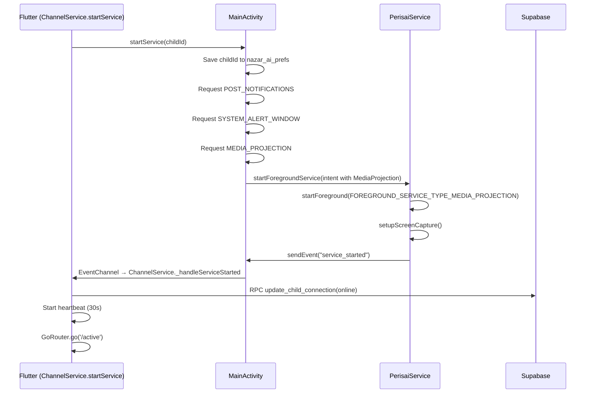
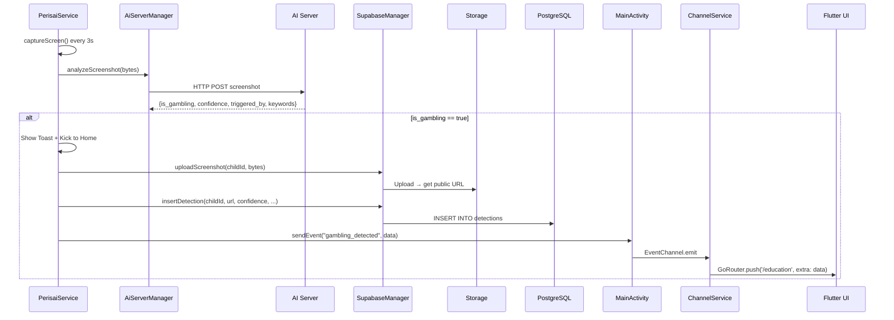

# ARCHITECTURE_FLOWCHART.md

```mermaid
flowchart TB
    %% ==================== FLUTTER LAYER ====================
    subgraph FLUTTER [Flutter App (Dart)]
        direction TB
        
        %% Entry & Config
        MAIN[main.dart\nInit Supabase\nStart ChannelService]
        ROUTER[router.dart\nGoRouter + navigatorKey]
        SPLASH[SplashScreen\nRead SharedPreferences]
        
        %% Auth Flow
        ROLE[RoleSelectScreen]
        LOGIN[LoginScreen]
        REGISTER[RegisterScreen]
        LOADING[LoadingScreen]
        
        %% Parent Dashboard
        DASH[DashboardScreen]
        MAIN_SCREEN[MainScreen\nBottom Nav Shell]
        CHILD_DETAIL[ChildDetailScreen]
        FAMILY[FamilyScreen\nAdd Child]
        ACTIVITY[ActivityScreen\nDetections List]
        SHIELD[ShieldScreen\nPause/Resume]
        DETAIL[DetectionDetailScreen]
        
        %% Child Flow
        ONBOARD[OnboardingScreen]
        SCAN_QR[ScanQrScreen\nPair with Parent]
        ACTIVE[ActiveScreen\nPopScope - Locked]
        EDUCATION[EducationScreen\nGambling Warning]
        
        %% Settings
        SETTINGS[SettingsScreen]
        EDIT_PROFILE[EditProfileScreen]
        
        %% Core Services
        CHANNEL[ChannelService\nEventChannel + MethodChannel]
        SUPABASE_SVC[SupabaseService\nDB Queries + Storage]
        
        %% Providers
        LANG_PROV[LanguageProvider]
    end

    %% ==================== NATIVE ANDROID LAYER ====================
    subgraph ANDROID [Native Android (Kotlin)]
        direction TB
        
        MAIN_ACT[MainActivity\nFlutterActivity\nChannel Bridge]
        SERVICE[PerisaiService\nForeground Service\nMediaProjection]
        URL_CHK[UrlCheckerService\nAccessibility Service]
        SUPABASE_MGR[SupabaseManager\nREST + Storage Upload]
        AI_MGR[AiServerManager\nHTTP → AI Server]
        BOOT[BootReceiver\nAuto-start on reboot]
    end

    %% ==================== BACKEND ====================
    subgraph BACKEND [Supabase Backend]
        direction TB
        AUTH[Auth\nEmail/Password]
        DB[(PostgreSQL\nTables: children, detections)]
        STORAGE[(Storage\nBucket: screenshots)]
        REALTIME[Realtime\nSubscriptions]
        RPC[RPC Functions\nupdate_child_connection]
    end

    %% ==================== AI SERVER ====================
    subgraph AI_SERVER [External AI Server]
        AI_API[Analyze Screenshot\nReturn: is_gambling, confidence, keywords]
    end

    %% ==================== DATA FLOWS ====================
    
    %% App Startup
    MAIN --> CHANNEL
    MAIN --> ROUTER
    MAIN --> SPLASH
    
    %% Splash Decision
    SPLASH -->|session + parent| DASH
    SPLASH -->|session + child| SCAN_QR
    SPLASH -->|no session| ROLE
    
    %% Auth Flow (Parent)
    ROLE --> LOGIN
    ROLE --> REGISTER
    LOGIN --> LOADING
    REGISTER --> LOADING
    LOADING --> DASH
    
    %% Parent Dashboard
    DASH --> MAIN_SCREEN
    MAIN_SCREEN --> FAMILY
    MAIN_SCREEN --> ACTIVITY
    MAIN_SCREEN --> SHIELD
    MAIN_SCREEN --> SETTINGS
    FAMILY -->|Add Child| ADD_CHILD[AddChildScreen]
    ACTIVITY -->|Tap| DETAIL
    CHILD_DETAIL -.->|Realtime| DB
    
    %% Child Flow
    SCAN_QR -->|QR Paired| ACTIVE
    ACTIVE -->|PopScope Block| ACTIVE
    ACTIVE -.->|Event: gambling_detected| EDUCATION
    
    %% Channel Service - Bridge
    CHANNEL <-->|EventChannel\ncom.nazar.ai/detection_stream| MAIN_ACT
    CHANNEL <-->|MethodChannel\ncom.nazar.ai/service_control| MAIN_ACT
    
    %% Channel Service Methods
    CHANNEL -.->|startService(childId)| MAIN_ACT
    CHANNEL -.->|stopService()| MAIN_ACT
    
    %% Native Events → Flutter
    MAIN_ACT -.->|gambling_detected| CHANNEL
    MAIN_ACT -.->|service_started| CHANNEL
    MAIN_ACT -.->|service_stopped| CHANNEL
    MAIN_ACT -.->|permission_denied| CHANNEL
    
    %% Channel Handlers
    CHANNEL -->|gambling_detected → push /education| EDUCATION
    CHANNEL -->|service_started → go /active + heartbeat| ACTIVE
    CHANNEL -->|service_stopped → SnackBar + status offline| ACTIVE
    CHANNEL -->|permission_denied → go /role-select| ROLE
    
    %% Service Lifecycle
    MAIN_ACT -->|startPerisaiService(childId)\nSave to nazar_ai_prefs| SERVICE
    MAIN_ACT -->|Permission Chain\n1. POST_NOTIFICATIONS\n2. SYSTEM_ALERT_WINDOW\n3. MEDIA_PROJECTION| SERVICE
    MAIN_ACT -->|stopPerisaiService()| SERVICE
    
    %% PerisaiService Operations
    SERVICE -->|MediaProjection\nScreen Capture| SERVICE
    SERVICE -->|CAPTURE_INTERVAL 3s\nScreenshot → JPEG| AI_MGR
    AI_MGR -->|HTTP POST\nscreenshot bytes| AI_API
    AI_API -->|JSON: is_gambling, confidence, keywords| AI_MGR
    AI_MGR --> SERVICE
    
    %% Gambling Detected Path
    SERVICE -->|is_gambling=true\n1. Toast warning\n2. Kick to Home\n3. Upload screenshot| SUPABASE_MGR
    SUPABASE_MGR -->|Upload → Storage| STORAGE
    SUPABASE_MGR -->|Insert detection| DB
    SUPABASE_MGR -->|RPC update_child_connection| RPC
    SERVICE -->|Event: gambling_detected| MAIN_ACT
    
    %% Service Status Updates
    SERVICE -->|service_started → RPC online| RPC
    SERVICE -->|Heartbeat 30s → RPC online| RPC
    SERVICE -->|Network callback → RPC online| RPC
    SERVICE -->|service_stopped → RPC offline_manual| RPC
    BOOT -->|Boot → RPC online + heartbeat| RPC
    
    %% Parent Realtime
    DB -->|Realtime subscription| CHILD_DETAIL
    DB -->|Realtime subscription| ACTIVITY
    DB -->|Realtime subscription| DASH
    
    %% Supabase Service Queries
    SUPABASE_SVC <-->|Query children| DB
    SUPABASE_SVC <-->|Query detections| DB
    SUPABASE_SVC <-->|Upload/download| STORAGE
    SUPABASE_SVC <-->|Auth| AUTH
    
    %% Settings
    SETTINGS --> EDIT_PROFILE
    SETTINGS -.->|Sign Out| ROLE
    
    %% Styling
    classDef flutter fill:#1E1E1E,color:#00D4AA,stroke:#00D4AA
    classDef android fill:#1E1E1E,color:#FF6D00,stroke:#FF6D00
    classDef backend fill:#1E1E1E,color:#3ECF8E,stroke:#3ECF8E
    classDef ai fill:#1E1E1E,color:#FFD600,stroke:#FFD600
    
    class MAIN,ROUTER,SPLASH,ROLE,LOGIN,REGISTER,LOADING,DASH,MAIN_SCREEN,CHILD_DETAIL,FAMILY,ACTIVITY,SHIELD,DETAIL,ONBOARD,SCAN_QR,ACTIVE,EDUCATION,SETTINGS,EDIT_PROFILE,CHANNEL,SUPABASE_SVC,LANG_PROV flutter
    class MAIN_ACT,SERVICE,URL_CHK,SUPABASE_MGR,AI_MGR,BOOT android
    class AUTH,DB,STORAGE,REALTIME,RPC backend
    class AI_API ai
```

---

## Key Architecture Notes

### Channel Contract (Flutter ↔ Native)
| Channel | Type | Direction | Events/Methods |
|---------|------|-----------|----------------|
| `com.nazar.ai/detection_stream` | EventChannel | Android → Flutter | `gambling_detected`, `service_started`, `service_stopped`, `permission_denied` |
| `com.nazar.ai/service_control` | MethodChannel | Flutter → Android | `startService(childId)`, `stopService()` |

### SharedPreferences Keys
| Layer | File | Keys |
|-------|------|------|
| Flutter | SharedPreferences | `role` (parent/child), `child_id`, `flutter.child_id` |
| Native | `nazar_ai_prefs` | `child_id` |

> ⚠️ **Critical**: Flutter and Native use **different** SharedPreferences files. Native reads `child_id` from `nazar_ai_prefs`, Flutter writes to its own prefs.

### Service Startup Sequence


### Gambling Detection Pipeline


### Connection Status Logic (Child Model)
```
effectiveStatus = 
  if connectionStatus == online:
    if lastSeen == null → offline_manual
    else if now - lastSeen >= 10min → offline_internet
    else → online
  else → connectionStatus (offline_internet / offline_manual)
```

### Realtime Subscriptions (Parent Dashboard)
- Dashboard listens to `detections` table changes → auto-refresh activity feed
- ChildDetail listens to `children` table → live connection status
- Uses Supabase Realtime with anon key (RLS policies filter by parent_id)

---

## File: `ARCHITECTURE_FLOWCHART.md`
Generated for NAZAR.AI hackathon project