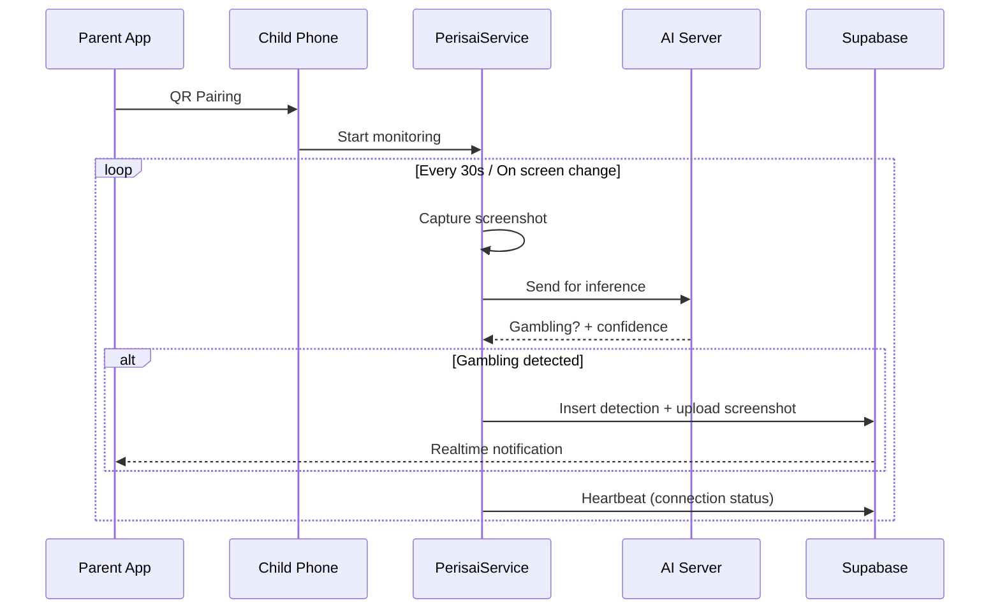

# NAZAR.AI

> **AI-powered parental control app** that detects online gambling content on children's phones in real-time.

Built for **CORE3D 2026 Hackathon** — 2nd Place winner.


## Architecture

```
┌─────────────────────────────────────────────────────────────────────────────┐
│                              FLUTTER APP (Dart)                              │
│  ┌──────────────┐  ┌──────────────┐  ┌──────────────┐  ┌──────────────┐    │
│  │   Auth       │  │  Dashboard   │  │  Pairing     │  │  Education   │    │
│  │  (login/     │  │  (children,  │  │  (QR scan,   │  │  (gambling   │    │
│  │   register)  │  │   detections)│  │   active)    │  │   awareness) │    │
│  └──────┬───────┘  └──────┬───────┘  └──────┬───────┘  └──────┬───────┘    │
│         │                 │                 │                 │            │
│         └─────────────────┼─────────────────┼─────────────────┘            │
│                           ▼                                                 │
│              ┌────────────────────────┐                                    │
│              │    ChannelService      │ ◄── MethodChannel                  │
│              │  (Flutter ↔ Native)    │ ──► EventChannel                   │
│              └───────────┬─────────────┘                                    │
└──────────────────────────┼──────────────────────────────────────────────────┘
                           │
          ┌────────────────┴────────────────┐
          ▼                                 ▼
┌─────────────────────┐           ┌─────────────────────┐
│   ANDROID NATIVE    │           │     SUPABASE        │
│   (Kotlin)          │           │   (PostgreSQL)      │
│                     │           │                     │
│ ┌─────────────────┐ │           │  • parents          │
│ │ PerisaiService  │ │           │  • children         │
│ │ (Foreground     │ │           │  • detections       │
│ │  MediaProjection)│ │           │  • storage buckets  │
│ │   • Capture     │ │           │  • realtime         │
│ │   • AI inference│ │           │  • RLS policies     │
│ └────────┬────────┘ │           └─────────────────────┘
│          │          │
│ ┌────────┴────────┐ │
│ │ UrlCheckerService│ │  (Accessibility Service)
│ │  • URL scanning │ │
│ └─────────────────┘ │
└─────────────────────┘
```

### Data Flow



---

## Features

| Feature | Description |
|---------|-------------|
| **Real-time Detection** | On-device screen capture + AI inference every few seconds |
| **Gambling Classification** | Detects casino, betting, slots, poker, lottery keywords & visual patterns |
| **QR Pairing** | One-tap parent↔child linking via encrypted QR code |
| **Parent Dashboard** | Live connection status, detection history, confidence scores |
| **Education Screen** | Auto-shows gambling awareness content when detection triggers |
| **Pause Monitoring** | Parents can temporarily pause (server-enforced via `paused_until`) |
| **Push Notifications** | Firebase Messaging alerts parents instantly |
| **Offline Resilient** | Queues detections locally, syncs when online |

---

## AI Pipeline

```
Screenshot Capture (MediaProjection)
           │
           ▼
    ┌─────────────┐
    │  Preprocess │  ──► Resize, normalize, compress
    └──────┬──────┘
           │
           ▼
    ┌─────────────┐
    │  AI Server  │  ──► Custom trained model (YOLO/Classifier)
    │  (Inference)│      Detects: gambling UI, keywords, colors
    └──────┬──────┘
           │
           ▼
    ┌─────────────┐
    │ Post-process│  ──► Confidence threshold, keyword extraction
    └──────┬──────┘
           │
           ▼
    ┌─────────────┐
    │  Supabase   │  ──► Insert detection, upload screenshot
    │  (storage)  │      Trigger realtime → parent notification
    └─────────────┘
```

**Model Details:**
- **Input:** 640×640 RGB screenshot (compressed to ~50KB)
- **Output:** `gambling_detected` (bool), `confidence` (0–1), `keywords` (array), `triggered_by` (screen|url)
- **Latency:** ~200–500ms per inference on mid-range devices
- **Privacy:** Screenshots never leave device unless gambling detected

---

## Tech Stack

| Layer | Technology |
|-------|------------|
| **Frontend** | Flutter 3.24+, Dart 3.5+, Riverpod, go_router |
| **Backend** | Supabase (PostgreSQL, Auth, Storage, Realtime) |
| **Notifications** | Firebase Cloud Messaging + flutter_local_notifications |
| **Native Android** | Kotlin, MediaProjection API, Foreground Service |
| **AI Inference** | Custom model server (separate repo) |
| **CI/CD** | GitHub Actions → Flutter build APK |

---

## Project Structure

```
lib/
├── core/
│   ├── config/          # Supabase, env config
│   ├── constants/       # AppStrings, AppColors
│   ├── providers/       # Riverpod providers
│   ├── theme/           # Theme, colors, typography
│   ├── utils/           # Logger, helpers
│   └── widgets/         # Shared UI components
├── features/
│   ├── auth/            # Login, register, role select, splash
│   ├── dashboard/       # Parent dashboard, child detail, shield
│   ├── detail/          # Detection detail screen
│   ├── education/       # Gambling awareness content
│   ├── pairing/         # QR scan, add child, active monitoring
│   └── settings/        # Edit profile, app settings
├── models/              # DTOs: Child, Detection, UserProfile
├── router.dart          # All go_router routes
├── main.dart            # App entry, Supabase init, ChannelService
└── services/
    ├── channel_service.dart   # Flutter↔Native bridge
    └── supabase_service.dart  # Supabase queries

android/app/src/main/kotlin/com/nazar/ai/
├── PerisaiService.kt      # Foreground service, screen capture
├── SupabaseManager.kt     # Native Supabase inserts
├── AiServerManager.kt     # AI inference HTTP client
├── UrlCheckerService.kt   # Accessibility service for URLs
└── MainActivity.kt        # Method/Event channel bridge

supabase/migrations/
├── 20260701000001_initial_schema.sql
├── 20260701000002_functions_and_triggers.sql
├── 20260701000003_rls_policies.sql
├── 20260701000004_storage_buckets.sql
└── 20260701000005_pause_enforcement.sql
```

---

## Getting Started

### Prerequisites
- Flutter SDK ≥ 3.24
- Android Studio / VS Code
- Supabase project (free tier works)
- Firebase project (for push notifications)
- AI inference server (see below)

### 1. Clone & Install
```bash
git clone https://github.com/anshul1058/NAZAR.ai.git
cd NAZAR.ai
flutter pub get
```

### 2. Configure Supabase
```bash
cp .env.example .env
# Edit .env with your Supabase URL & anon key
```

### 3. Configure Native Secrets
```bash
# android/local.properties (auto-generated, add secrets)
SUPABASE_URL=https://your-project.supabase.co
SUPABASE_SERVICE_ROLE_KEY=eyJ...  # Service role (bypasses RLS)
AI_SERVER_URL=https://your-ai-server.com/predict
```

### 4. Run Migrations
```bash
# In Supabase Dashboard → SQL Editor, run each file in supabase/migrations/
# Or use Supabase CLI:
supabase db push
```

### 5. Run App
```bash
flutter run
```

---

## AI Server (Separate Deployment)

The AI inference runs on a separate server. Expected API:

```http
POST /predict
Content-Type: multipart/form-data

Form fields:
  - image: screenshot file (JPEG, max 640×640)
  - child_id: UUID string
  - timestamp: ISO8601

Response:
{
  "gambling_detected": true,
  "confidence": 0.92,
  "keywords": ["casino", "bet", "slot", "jackpot"],
  "triggered_by": "screen",
  "details": { "model_version": "v2.1", "inference_ms": 312 }
}
```

**Model Training Notes:**
- Trained on curated dataset of gambling apps/websites
- Classes: `gambling` vs `safe`
- Augmentation: rotation, brightness, compression artifacts
- Export: ONNX/TensorRT for mobile optimization

---

## Security & Privacy

| Measure | Implementation |
|---------|----------------|
| **Data Minimization** | Only uploads screenshot *when gambling detected* |
| **Encryption** | TLS 1.3 for all network traffic |
| **RLS Policies** | Parents only see their own children's data |
| **Service Role** | Native uses service_role key (server-side only) |
| **No Tracking** | No analytics, no third-party SDKs |
| **Local-First** | Works offline, syncs when online |

---

## Permissions (Android)

| Permission | Purpose |
|------------|---------|
| `FOREGROUND_SERVICE` | Run PerisaiService persistently |
| `FOREGROUND_SERVICE_MEDIA_PROJECTION` | Screen capture (Android 14+) |
| `POST_NOTIFICATIONS` | Show detection alerts |
| `SYSTEM_ALERT_WINDOW` | Overlay for active monitoring UI |
| `ACCESSIBILITY_SERVICE` | URLCheckerService (optional) |

---

## Build Release APK

```bash
flutter build apk --release
# Output: build/app/outputs/flutter-apk/app-release.apk
```

---

## License

MIT License — see [LICENSE](LICENSE)

---

## Acknowledgments

- **CORE3D 2026 Hackathon** — Universitas Andalas
- **Supabase** — Backend infrastructure
- **Flutter Team** — Amazing framework
- **Open Source Community** — Libraries & tools used

---

## Contact

**Author:** Anshul (anshul1058)
**Repo:** https://github.com/anshul1058/NAZAR.ai
